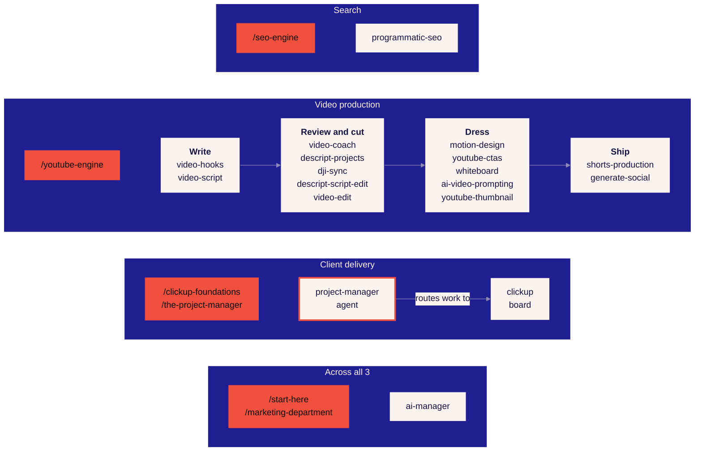
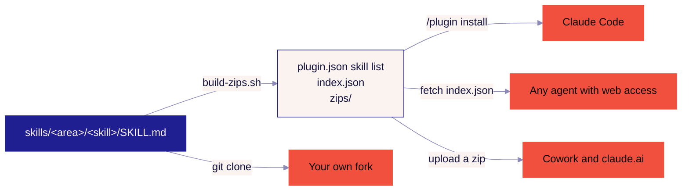

# ai-agency

**19 agent skills for Claude**, plus 6 slash commands and an agent, built for the 3 jobs an
agency repeats every week: getting found in search, making video, and delivering client work.
One more, `ai-manager`, stops the rest of the shelf from rotting as you add to it.

It's the working copy of what's taught in **[AI Agency][skool]**, a free Skool room. The course
is the mental model you read. This repo is the same system, written for your own Claude to run.

```
/plugin marketplace add heyramzi/ai-agency
/plugin install ai-agency@ai-agency
```

You'll find each skill explained with examples at **[ai.heyramzi.com/skills](https://ai.heyramzi.com/skills)**.

[skool]: https://go.upsys-consulting.com/skool

## What's in it



Cream boxes are skills, red boxes are slash commands, and the red-ringed box is the agent.
`/start-here` and `/marketing-department` aren't tied to 1 part. You score your whole agency
with the first and build The Media Buyer's 5 files with the second.

### Search

| Skill | Does |
| --- | --- |
| [programmatic-seo](skills/search/programmatic-seo) | The whole pipeline: what page to write next, keyword and prompt research, the draft, and the off-site mentions that decide whether an assistant names you |

It wants Search Console access through `gcloud`. Keyword data comes from Google autocomplete
and the Keyword Planner, both free, and a `SERPER_API_KEY` is optional.

### Video production

In the order you make a video, from the first line of the hook to the posts you cut out of it.

| Skill | Does |
| --- | --- |
| [video-hooks](skills/video/video-hooks) | The opening. Competing variants by named mechanism, each rated for drop-off risk |
| [video-script](skills/content/video-script) | Picks what to film and writes the words: long-form body, hook, or a Short |
| [video-coach](skills/video/video-coach) | Reviews the take against its plan before a single cut, and returns 1 habit to change |
| [descript-projects](skills/video/descript-projects) | Footage into Descript, named and foldered from the terminal |
| [dji-sync](skills/video/dji-sync) | The DJI lav take waveform-matched to the phone clip and swapped in losslessly |
| [descript-script-edit](skills/video/descript-script-edit) | Cuts the false starts and filler, then plans the jump cuts, layouts and b-roll |
| [video-edit](skills/editor-os/video-edit) | Runs the passes of an edit: ledger, cuts, layouts, clips, checks, Shorts or long-form |
| [motion-design](skills/editor-os/motion-design) | Remotion clips, figures, captions and CTAs for anything that isn't your face |
| [youtube-ctas](skills/video/youtube-ctas) | Transparent 1920x1080 overlays: subscribe, like, lower third, end screen |
| [whiteboard](skills/design/whiteboard) | The board a video talks over: tldraw, a compiled still, or Excalidraw live on the iPad |
| [whiteboard](skills/video/whiteboard) | The Excalidraw engine itself, boards written as TypeScript in `tool/` and drawn onto the iPad on camera |
| [ai-video-prompting](skills/video/ai-video-prompting) | Prompts for Veo, Kling, Seedance and the rest, plus the shot list behind them |
| [youtube-thumbnail](skills/design/youtube-thumbnail) | The thumbnail, from a measurement you run on your own niche, then a render |
| [shorts-production](skills/video/shorts-production) | A finished Short taken to a scheduled, coded task, with the export shipped untouched |
| [generate-social](skills/content/generate-social) | The transcript turned into LinkedIn and X posts |

A few need more than a terminal. `motion-design` and `youtube-ctas` render through
[Remotion](https://remotion.dev). `youtube-thumbnail` renders with
[`scripts/render.mjs`](skills/design/youtube-thumbnail/scripts/render.mjs), which wants a Gemini
API key or a gateway. The `whiteboard` engine in [`skills/video/whiteboard/tool`](skills/video/whiteboard/tool)
is the one thing here with an install step, `pnpm install` once, because Excalidraw's live protocol
is socket.io.

### Client delivery

| Skill | Does |
| --- | --- |
| [clickup](skills/delivery/clickup) | Every read and write in ClickUp through the `cu` command line, plus the browser path for templates, automations and dashboards |
| [board](skills/delivery/board) | A task moved, specced into a brief, built into a reviewed PR, or shipped and closed |

The agent on top is [project-manager](agents/delivery/project-manager.md). It reads the board,
names what's late and what's waiting on a client, and proposes 1 move per problem. It doesn't
press the button itself.

Both skills need the `cu` command line. Its install line is handed out in The Project Manager,
lesson 2. Without it they read as documentation.

### Keeping the shelf honest

| Skill | Does |
| --- | --- |
| [ai-manager](skills/admin/ai-manager) | Writes, repairs and cleans skills and agents |

Agent config fails without a sound. A broken skill drops out of the list with no error, and a
duplicated name collapses to 1 side. So it rots 2 ways. It grows, until the model is
picking between 4 skills that all look right. And it goes stale, so every session pays again for
the same wrong turn. `ai-manager heal` writes the lesson into the file that should've known it,
in the session that learned it. `ai-manager clean` merges the overlap back down. Heal all the
time and clean on a schedule, or the 2 passes fight: one adds caveats while the other strips them.

## You don't need a magic phrase

Once a skill is installed, describe the job and Claude picks the skill up:

> Look at that keyword file and tell me the first 10 articles to write, best intent first.

> Write me 3 hooks for a video about why agency retainers stall. Rate each one.

> What's late on the delivery board, and what's waiting on a client?

## The commands run the courses

The free courses in [AI Agency][skool] ship a second copy of themselves, written for the agent. Type
the command and it runs 1 module a sitting on your own business, asks you the decisions that are
yours, stops at the checkpoint and names the lesson you read next.

| Command | Course | Runs |
| --- | --- | --- |
| `/start-here` | Start Here | Scores your agency out of 12, then builds the intake from start to finish |
| `/clickup-foundations` | ClickUp Foundations | Your own ClickUp, from the 5 decisions to the template and the 3 automations |
| `/seo-engine` | The SEO Copywriter | Your rows, your keyword file, 1 page shape, then the console queue |
| `/marketing-department` | The Media Buyer | The 5 files, built on your own calls and your own numbers |
| `/youtube-engine` | The Video Producer | The 4 numbers off your own channel, from the runtime table to the ledger |
| `/the-project-manager` | The Project Manager | Your board, your capacity number, and the 4 gates the work passes |

None of them touch a live account without showing you first, none invent a number you haven't
measured, and every one stops when the module ends.

Start Here opens the day you join. You reach the others on the room's level ladder by posting and
replying, which takes a few days of turning up.

## 4 ways in



**Claude Code.** The 2 lines at the top. Or clone the repo and point Claude Code at the folder.

**An agent with no terminal.** 1 fetch tells it what's here:

> Read https://raw.githubusercontent.com/heyramzi/ai-agency/main/index.json and tell me which skill fits.

[`index.json`](index.json) lists every skill's name, area and description with the raw URL of
its `SKILL.md`, plus the 6 commands and the agent. It's written out because no agent can list a
directory over HTTP, and guessing raw URLs off a README is where a run goes wrong. Point any
Claude at a `skill_md` URL and it runs that skill without installing anything. The commands work
the same way:

> Read https://raw.githubusercontent.com/heyramzi/ai-agency/main/commands/seo-engine.md and run it with me.

**Cowork and claude.ai.** They take 1 skill at a time as a zip, and every skill is prebuilt in
[`zips/`](zips). Download one, then go to Customize, Skills, the plus button, Create skill,
Upload a skill. About a minute per skill, and it's the same skill either way.

## Fork it

This repo is meant as the base for your own kit. Add your skills under `skills/<area>/<skill>/`
and keep `ai-manager`, so the shelf stays honest as it grows.

```
.claude-plugin/
  marketplace.json      this repo as a marketplace
  plugin.json           this repo as a plugin
commands/<course>.md    1 slash command per Skool course
agents/<area>/          1 folder per area, like the skills
skills/<area>/<skill>/
  SKILL.md              frontmatter and instructions
  references/           detail loaded only when needed
  scripts/              executables, committed, no install step
zips/<skill>.zip        1 zip per skill, for Cowork and claude.ai
index.json              every skill, command and agent with its raw URL
```

A nested folder stays invisible until `plugin.json` names it. That list, `index.json` and the
zips are all generated, so after any change under `skills/`, run `./scripts/build-zips.sh` and
commit what it writes. A new skill in a fork is 1 folder plus 1 run of the script.

File each skill by whose job it is, not by which kit uses it. The thumbnail is design work and
the posts are content work, so they file under `design` and `content` and still run in the video
order above.

A skill carries its own references and a dependency-free script, so it works on a fresh clone
with Node 20 or later and nothing installed. The `whiteboard` engine is the 1 exception.

Check your fork with the same tools:

```bash
node skills/admin/ai-manager/scripts/heal.cjs check skills
python3 skills/admin/ai-manager/scripts/review_skill.py skills
python3 skills/admin/ai-manager/scripts/context_cost.py skills
```

They exit non-zero when something's wrong, so they drop into CI as they are.

## The room

The courses these skills came out of, a build run in a real workspace each week, and a place to
ask about your own setup: **[go.upsys-consulting.com/skool][skool]**. It's free, and every
request gets read by hand.
