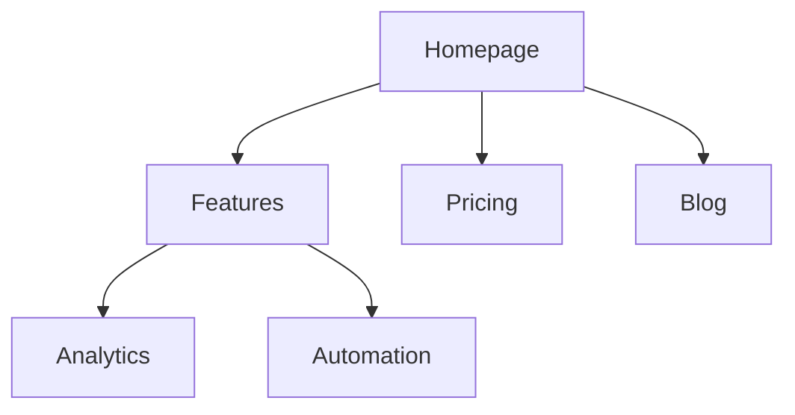

# Site Architecture

Plan page hierarchy, navigation, URL patterns, and internal linking.

## Before Planning

If `.agents/product-marketing-context.md` or `.claude/product-marketing-context.md` exists, read first.

Gather: business (what company does, audiences, top 3 site goals), state (new or restructuring; if restructuring: what's broken, URLs to preserve), site type (SaaS, content/blog, e-commerce, docs, hybrid, small business), content inventory (page count, 5 most important pages, planned expansions).

## Site Types

| Type | Depth | Key Sections | URL Pattern |
| --- | --- | --- | --- |
| SaaS marketing | 2-3 | Home, Features, Pricing, Blog, Docs | `/features/name`, `/blog/slug` |
| Content/blog | 2-3 | Home, Blog, Categories, About | `/blog/slug`, `/category/slug` |
| E-commerce | 3-4 | Home, Categories, Products, Cart | `/category/subcategory/product` |
| Documentation | 3-4 | Home, Guides, API Reference | `/docs/section/page` |
| Hybrid SaaS+content | 3-4 | Home, Product, Blog, Resources, Docs | `/product/feature`, `/blog/slug` |
| Small business | 1-2 | Home, Services, About, Contact | `/services/name` |

See [references/site-type-templates.md](references/site-type-templates.md).

## Page Hierarchy

**3-click rule:** any important page reachable in 3 clicks from homepage. Critical pages 4+ deep = something's wrong.

| Approach | Best For | Tradeoff |
| --- | --- | --- |
| Flat (2 levels) | Small sites, portfolios | Simple; doesn't scale |
| Moderate (3 levels) | Most SaaS, content | Good balance |
| Deep (4+ levels) | E-commerce, large docs | Scales but risks burying |

Go as flat as possible while keeping nav clean. 20+ items in a dropdown = add hierarchy.

| Level | What | Example |
| --- | --- | --- |
| L0 | Homepage | `/` |
| L1 | Primary sections | `/features`, `/blog`, `/pricing` |
| L2 | Section pages | `/features/analytics`, `/blog/seo-guide` |
| L3+ | Detail pages | `/docs/api/authentication` |

**ASCII tree** for quick drafts/text-only/simple structures. **Mermaid** for visual presentations, complex relationships, nav zones.

```
Homepage (/)
├── Features (/features)
│   ├── Analytics (/features/analytics)
│   └── Automation (/features/automation)
├── Pricing (/pricing)
├── Blog (/blog)
├── Docs (/docs)
└── Contact (/contact)
```

## Navigation

| Nav | Purpose | Placement |
| --- | --- | --- |
| Header | Primary, always visible | Top of every page |
| Dropdown | Organize sub-pages | Expands from header |
| Footer | Secondary, legal, sitemap | Bottom |
| Sidebar | Section (docs, blog) | Left within section |
| Breadcrumbs | Current location | Below header |
| Contextual | Related content | Within content |

**Header rules:** 4-7 items max · CTA button rightmost · logo links home (left) · order by priority · mega menu 3-4 columns max.

**Footer columns:** Product (Features, Pricing, Integrations, Changelog) · Resources (Blog, Case Studies, Templates, Docs) · Company (About, Careers, Contact, Press) · Legal (Privacy, Terms, Security).

**Breadcrumbs:** mirror URL hierarchy. Every segment clickable except current page.
```
Home > Features > Analytics
Home > Blog > SEO Category > Post Title
```

See [references/navigation-patterns.md](references/navigation-patterns.md).

## URL Structure

**Principles:** readable (`/features/analytics` not `/f/a123`) · hyphens not underscores · reflect hierarchy · consistent trailing slash · lowercase · short but descriptive.

| Page Type | Pattern | Example |
| --- | --- | --- |
| Homepage | `/` | `example.com` |
| Feature | `/features/{name}` | `/features/analytics` |
| Pricing | `/pricing` | `/pricing` |
| Blog post | `/blog/{slug}` | `/blog/seo-guide` |
| Blog category | `/blog/category/{slug}` | `/blog/category/seo` |
| Case study | `/customers/{slug}` | `/customers/acme-corp` |
| Docs | `/docs/{section}/{page}` | `/docs/api/authentication` |
| Legal | `/{page}` | `/privacy`, `/terms` |
| Landing | `/{slug}` or `/lp/{slug}` | `/free-trial`, `/lp/webinar` |
| Comparison | `/compare/{x}` or `/vs/{x}` | `/compare/competitor` |
| Integration | `/integrations/{name}` | `/integrations/slack` |
| Template | `/templates/{slug}` | `/templates/marketing-plan` |

**Mistakes:** dates in blog URLs (`/blog/2024/01/15/...` adds no value) · over-nesting · changing URLs without 301 redirects · IDs in URLs · query params for content · inconsistent patterns.

## Visual Sitemap (Mermaid)



For nav zones use `subgraph Header Nav` / `subgraph Footer Nav`. See [references/mermaid-templates.md](references/mermaid-templates.md).

## Internal Linking

| Type | Purpose | Example |
| --- | --- | --- |
| Navigational | Move between sections | Header, footer, sidebar |
| Contextual | Related content in text | `[analytics](/features/analytics)` |
| Hub-and-spoke | Cluster to hub | Blog posts → pillar page |
| Cross-section | Related across sections | Feature → case study |

**Rules:** no orphan pages (≥1 inbound link) · no broken links · descriptive anchor text · 5-10 internal links per 1,000 words · link to important pages more often · breadcrumbs on every page · related content sections at page bottom · cross-section links where relevant.

**Hub-and-spoke:**
```
Hub: /blog/seo-guide
├── Spoke: /blog/keyword-research
├── Spoke: /blog/on-page-seo
└── Spoke: /blog/link-building
```
Each spoke → hub. Hub → all spokes. Spokes → each other where relevant.

## Output Format

1. **Page hierarchy (ASCII tree)**. full structure with URLs
2. **Visual sitemap (Mermaid)**. `graph TD` with nav zone subgraphs
3. **URL map table**. Page · URL · Parent · Nav Location · Priority
4. **Navigation spec**. header items (ordered, with CTA), footer sections, sidebar, breadcrumb notes
5. **Internal linking plan**. hubs and spokes, cross-section opportunities, orphan audit, links per key page

## Related Skills

- **seo-content-strategy**. what content, topic clusters
- **programmatic-seo**. pages at scale
- **seo-audit**. technical SEO, indexation
- **landing-page-cro**. page conversion
- **seo-schema-markup**. breadcrumb/navigation structured data
- **seo-competitor-alternatives**. comparison page frameworks
